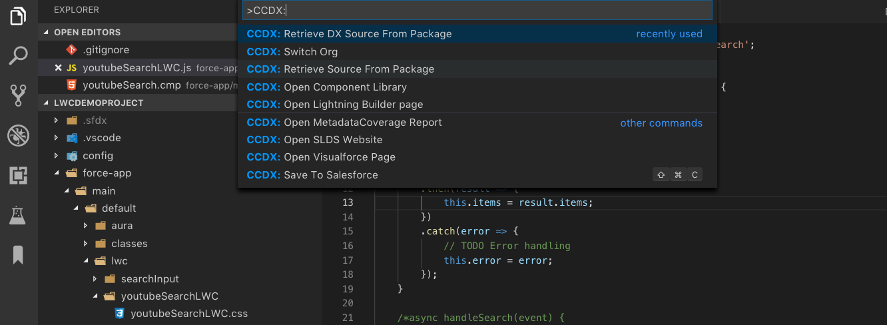
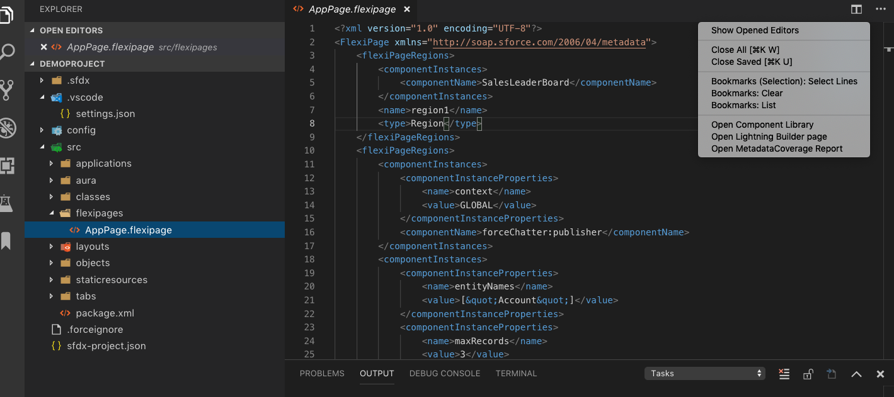
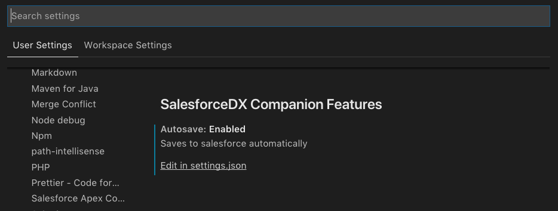

# SalesforceDX Code Companion 

**Note that this is not official from Salesforce, It Supplements Salesforce Official Plugins with some more great features for salesforce application development that I wish offical plugin had.**

Provides ability to save Apex Classes,Apex Triggers, Visualforce, AuraBundles, Lightning Web Component Bundles(under preview) and ApexComponents to Salesforce Org at blazing speed without source tracking. Also enables retrieving code from the salesforce unmanaged package in both DX and NonDX source formats .This extension requires users to have SalesforceDX CLI and also mo-dx-plugin(run **sfdx plugins:install mo-dx-plugin**) for SalesforceDX CLI.This Extension works with both scratch orgs and Non-scratch orgs.

It is highly recommended to use with Salesforce Extension Pack to get all the other good things salesforce official plugin offers (https://marketplace.visualstudio.com/items?itemName=salesforce.salesforcedx-vscode) .

## Requirements

This salesforce extension works only once you have installed Salesforce CLI and a mo-dx-plugin(run **sfdx plugins:install mo-dx-plugin** on your terminal) that has api for all the commands this plugin leverages .

1. Install SalesforceDX CLI from https://developer.salesforce.com/tools/sfdxcli based on your operating system.
2. Install mo-dx-plugin using the command `sfdx plugins:install mo-dx-plugin`.Note if you have already then make sure to update to latest always using `sfdx:plugins:update`
3. Salesforce official plugin provides great syntax and language support.Highly recommend to install (https://marketplace.visualstudio.com/items?itemName=salesforce.salesforcedx-vscode)
4. When you open the VScode , it is recommended to wait for few seconds for Salesforce CLI or Salesforce VScode plugin to authorize the connection .This plugin depends on CLI to do auth and uses the session from the CLI.
5. You have project workspace set up and have sfdx-project.json file in the root folder and you have ran sfdx force:auth:web:login for project folder and authorized your org with Salesforce CLI. 
6. If you open the project folder thats already authorized then wait for a minute or so before salesforce plugin authorizes to salesforce.

## Features

1. **Save Apex Class,Apex Trigger,Visualforce Page and Visualforce Component To Salesforce Org**

    

    By default autosave is enabled .Hence when you save file the extension will try to save the file to salesforce you have logged in by default.

    If you disable auto save feature you can also Right click on the File and click "Save To Salesforce Menu"

2. **Save Lightning Components (Both aura and LWC) To Salesforce Org**

    If you disable auto save feature you can also Right click on the File and click **_"Save To Salesforce"_**

    

    Save LWC (Available in Spring 19 pre-release orgs)

    

3. **Retrieve Source in DX Source format from Managed/Unmamaged package**

    Right click and click "Retrieve DX Source From Package" menu . Provide the name of the managed/unmanaged package in input box and press enter .

    You will notice that package.xml is autogenerated in the manifest directory and source code of the package is retrieved in DX source format in force-app folder. 

    

4. **Retrieve Source from Managed/Unmamaged package in regular metadata format**

    Right click and click "Retrieve Source From Package" menu. Provide the name of the managed/unmanaged package and press enter .

    You will notice that package.xml is autogenerated  and source code of the package is retrieved in src folder. Create a folder src if your project does not have one.

    

5. **Smart Navigations to VF page preview ,Lighnting App Builder Page ,Salesforce Lightning Design System Website ,Salesforce MetadataCoverage Report and Component Library URL**

    Screenshot shows how one can find these smart navigation

    

    ## Display Status of Save and Success

    1. When Saving files to Salesforce Status of Success or Failure is always displayed on the Terminal .
    2. Extension relies on Terminal API and hence to see any errors and progress keep the Terminal On.

    Below screenshot shows how the errors are logged

    

## Extension Shortcut Keys

To Save any of the supported files to salesforce you can use the below shorcut keys based on the operating system.

"MACOSX": "cmd+shift+c",
"win": "ctrl+shift+c",
"linux": "ctrl+shift+c",

## Issue Reporting

If you find any issues feel free to log it on the github page for the project @ https://github.com/msrivastav13/DX-Code-Companion/issues

You can also reach out to me via my twitter @msrivastav13 or via my MVP email handle mohith.shrivastava@salesforcemvps.com

## Release Notes

### 0.1.7

1.Switch between authenticated orgs using new Switch Org Command .This opens up to switch and deploy the code between orgs using SFDX:Deploy To Org Command

2.Fix AutoSave to now not run terminal command if file type is not supported
3.Better naming and Grouping .All Commands now CCDX as the prefix .
4.LWC(Lighnting Web Components) support improved
5.Introduces sfdx-core library in the build opening up lot more existing features to come in next release.

### 0.1.4

1.Auto Save enabled .You can disable using the autosave property

Use the settings (Select Code > Preferences > Settings) from the gear icon and modify the usersettings to disable the autosave feature as shown below by setting dx-code-companion.autosave.enabled as false .

2.Save LWC Components(Under preview).Upgrade the mo-dx-plugin using sfdx:plugins:update mo-dx-plugin

### 0.1.3

1.Add support to retrieve metadata using package name in regular metadata format

2.Add some useful link in editor title for vf preview , app builder page ,metadata coverage report and component Library.

### 0.0.4

1. Fixes issues for keyboard shortcut

### 0.0.2

1. Provides quick save apex,vf,aura bundles to salesforce server
2. Retrieve Source from Salesforce using DX Source format.
3. 3X performant than salesforce deploy command for apex , aura and vf files.

-----------------------------------------------------------------------------------------------------------

### For more information and contribution to project visit the below repositories and use issues tab to log any feedback or issues .

* [Mo DX Plugin Repository](https://github.com/msrivastav13/mo-dx-plugin)
* [DX Code Companion](https://github.com/msrivastav13/DX-Code-Companion)

**Enjoy!**
